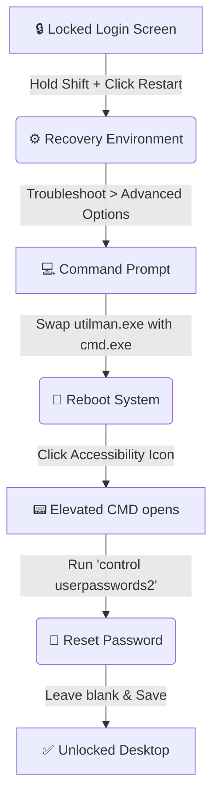

<div align="center">
  <h1>🔓 Windows 10 & 11 Password Reset Guide (No Software Needed)</h1>
  <p><i>A complete, step-by-step tutorial to bypass, recover, or reset a forgotten Windows local account password without a bootable USB or third-party software.</i></p>

  
  
  
  
  <br><br>
  <b>👨‍💻 Created & Maintained by <a href="https://github.com/your-github-username">Abdullah Al Noman</a></b>
</div>

---

> **🛑 EDUCATIONAL PURPOSES ONLY**
> *This documentation is designed to help users recover their **own** personal machines. Do not use this method on systems you do not own or have explicit permission to modify.*

## 🚀 Why Use This Method?
When you forget your Windows password, most guides tell you to download software or burn a USB drive. This guide uses a built-in accessibility trick (the **Utilman method**) to give you command-line access right from the lock screen. It works on both **Windows 10** and **Windows 11**.

## 🗺️ Process Flowchart



## 🗂️ Step-by-Step Execution Matrix

| Phase | Action | Command / Interface Input | Expected Result |
| :--- | :--- | :--- | :--- |
| **1. Boot to Recovery** | Hold `Shift` + click **Restart** on the login screen. Go to `Troubleshoot` > `Advanced options` > `Command Prompt`. | *N/A (Mouse & Keyboard)* | A black Command Prompt window appears. |
| **2. Swap Executables** | Navigate to the system folder and replace the Accessibility Manager with the Command Prompt. | `c:`<br>`cd windows\system32`<br>`ren utilman.exe utilman1.exe`<br>`ren cmd.exe utilman.exe` | System prepares to launch CMD from the login screen. |
| **3. Exit & Reboot** | Close the terminal and return to the main login screen. | `exit`<br>*(Then click **Continue**)* | Windows boots normally back to the lock screen. |
| **4. Trigger Access** | Click the **Accessibility icon** (bottom right, next to the power button). | *Click the icon* | Command Prompt opens with administrative privileges. |
| **5. Reset Password** | Launch the hidden User Accounts control panel and clear the password. | `control userpasswords2` | The User Accounts GUI pops up. |
| **6. Finalize** | Select your username, click **Reset Password**, leave fields blank, click OK. | *Leave Blank* ➡️ `OK` | Hit `Enter` to log in instantly without a password. |

<br>

## 💻 Terminal Command Cheat Sheet

Execute these exactly as shown during **Phase 2**:

```cmd
c:
cd windows\system32
ren utilman.exe utilman1.exe
ren cmd.exe utilman.exe
```

> **💡 Pro-Tip:** After you successfully log in, it is highly recommended to reverse this process (rename the files back to their original states) so your computer's accessibility button works normally again and to prevent unauthorized access.

---


